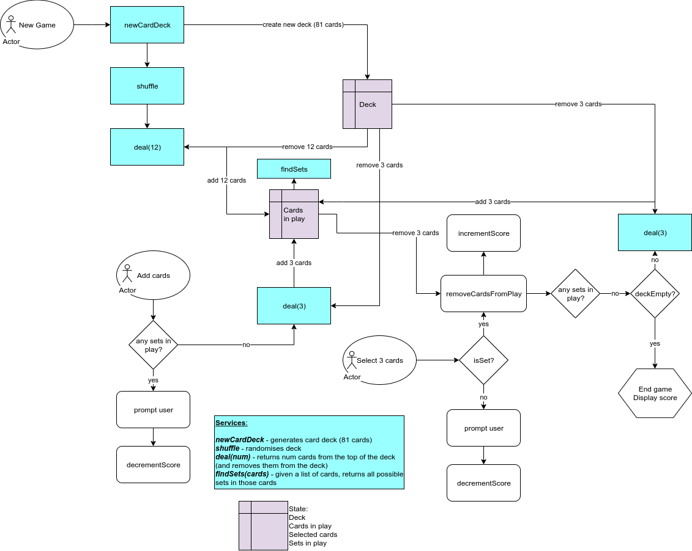

# Sets Game

This is a simple react app for the sets card game.

## Deployment

Deployed at https://ca-sets-game.netlify.com/

## Design

**Flows, services, and state**

## Contribute

If you want to contribute, look for open issues and start there. 

1. clone the repo
2. create a feature branch
3. implement the issue
4. raise a pull request

If there are no open issues, you can either:
- look for something that needs to be done and open an issue (I will respond to the issue)
- reach out to me on twitter (@JanelBrandon12) with a DM and I'll raise an issue for you to work on after we chat